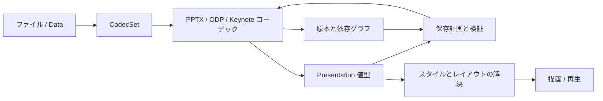

# SwiftSlides API将来設計

将来仕様。非同期I/O・上限付き一括読取・CodecCapabilities・PreservationSummary、機能別能力とwarningsの構造化診断、PackageGraph、事前エンコード型SavePlan、duplicateSlide/importSlide、ODP読取・限定書式索引、選択SlideReader、エンコード済Data用FileTargetの初期版、String ID編集・writer検査付きtransaction・登録照会とAPI入口の整合は[現行仕様](implementation-spec.md)へ移した。その他の追加APIと型、ここに示すコードは宣言案・利用例である。必要な機能は[機能台帳](feature-catalog.md)、依存順は[実装計画](implementation-roadmap.md)に記す。Keynoteの実アプリ確認は検証時点の最新版だけを対象とする。

## 設計方針

簡単な資料作成と安全な既存資料編集を同じ`Presentation`で行う。原本保持は裏側で自動的に働く。読み取れない内容は不明として示し、情報を失う保存は新しいAPIでは既定で拒否する。高速性は目標として設計し、数値は測定後に公開する。

- Swift 6.4の値型と`Sendable`、async/await、`@concurrent`、構造化TaskGroupを基本にする。同期APIも提供し、UIからの非同期入口は呼出元Actorを占有しない。現在の安定版を更新する際はCI・consumer・OS availabilityを検証する。
- ファイル内の名前より、`Slide`、`TextBody`、`Chart`など利用者の操作対象を主語にする。
- 直接指定値、継承値、実効値を分ける。読み込むだけで見た目を固定しない。
- モデルで意味を表す層、元形式を保持する層、外観を計算する層、描画・再生する層を分ける。
- 基本操作は少ない引数で使える。高度な検査・プロファイル・損失許容は必要時だけ使う。
- 小さいファイルの高速経路と、大きいファイルのメモリを制限する経路を用意する。

## 製品構成

| 製品 | 責務・依存 | 追加時期 |
|---|---|---|
| SlideCore | 形式中立モデル、単位、診断、CodecSet、原本保持契約、ZIP/XML基盤 | 現存、段階拡張 |
| SlidePPTX | OOXMLとOffice拡張、PPTX/PPTM/テンプレート/ショー | 現存、拡張 |
| SlideODP | ODF ZIP読取を現行へ移行。Flat XML・保存は将来 | P2/P3 |
| SlideKeynote | Keynote型registry、IWAオブジェクトグラフ、旧XMLの分岐 | P6 |
| SwiftSlides | 上記の再公開と便利な入口 | 現存 |
| SlidePPTLegacy | CFB、MS-PPTの旧バイナリ文書 | P7。中核への常時リンクを避ける |
| SlideDecrypt / SlideEncrypt | 暗号化入力/出力、パスワード、鍵導出 | P7。分離したオプション |
| SlideRendering / SlideRenderingApple | display list、文字計測、PDF/画像、Apple描画実装 | P8。形式コーデックから独立 |
| SlidePlayback | タイムライン評価、イベント、音声・動画再生の接続 | P8 |
| SlideSheetsBridge | SwiftSheetsとの表・チャートデータ交換 | P4以後、オプション |

IWAの低層処理は最初はSlideKeynote内部に置く。SwiftSheetsと実際に共用でき、両方の検証・依存方向が成立する場合にのみ共通基盤へ抽出する。公開`SlideIWA`製品を先に増やさない。



## 入口と形式

現在の`Presentation(data:)`、`read`、`inspect`、`encoded`、`data`、`write`、`CodecSet`は維持する。新しい引数は既定値を持つoverloadまたは新しいメソッドとして追加する。形式指定・結果型の語彙はSwiftSheetsに寄せるが、既存動作の変更は移行段階まで行わない。

宣言案:

```swift
extension Presentation {
    public static func read(contentsOf url: URL,
        options: ReadOptions = .init()) throws -> ReadResult
    public static func inspect(contentsOf url: URL,
        options: InspectOptions) throws -> PresentationSummary
    public func encoded(as format: PresentationFormat? = nil,
        options: WriteOptions = .init()) throws -> WriteResult
    public func planWrite(as format: PresentationFormat,
        options: SaveOptions = .init()) throws -> SavePlan
    public func save(to url: URL, using plan: SavePlan) throws -> SaveResult
    public static func convert(_ input: URL, to output: URL,
        as format: PresentationFormat, options: ConversionOptions = .init())
        throws -> ConversionResult
}
```

`PresentationFormat`はコーデックの系統。既存`.pptx/.pptm/.odp/.keynote`を維持し、`.pptLegacy`を将来追加する。テンプレートやショー、ZIP/ディレクトリ、Strict等は以下の直交する属性で扱う。

```swift
public struct FormatProfile: Sendable, Hashable {
    public var format: PresentationFormat
    public var documentKind: DocumentKind // presentation, template, slideshow, theme
    public var dialect: FormatDialect    // OOXML strict/transitional, ODF version, Keynote generation
    public var container: ContainerKind  // zip, directory, flatXML, compoundFile
}
```

組合せは自由に成功するわけではない。`CodecSet.capabilities(for:)`が有効な組合せを答え、無効な組合せは保存前にthrow。マクロの有無は形式と原本保持情報の双方で確認する。新規VBAプロジェクト生成は初期対応外。

保存先形式は新APIでも明示指定を優先。省略時は元形式、新規文書ならPPTX。URL拡張子と形式が矛盾する場合は診断して拒否し、拡張子だけで変換しない。SwiftSheetsの拡張子による形式選択を導入する場合は、明示オプションとして追加する。

読取は内容による判定。URLはディレクトリ形式も受け付ける。`Data`からディレクトリの外部リソースを補完しない。`CodecSet([.pptx])`のような部分リンクでも同じ操作を使える。未登録形式は`noCodec`、未対応世代・プロファイルは`unsupportedProfile`、破損は`corruptedPackage`等として区別する。

現行`PresentationCodec`は公開拡張点なので維持する。URL処理、遅延読取、save planは能力別の追加protocolに分け、既存実装には安全な既定実装を提供する。小さなコーデックが全能力を実装する義務を負わない。全入口がCodecSetの検査・診断規則を通る。

## 値型モデルとID

| モデル | 将来追加する主要内容 |
|---|---|
| Presentation | ordered slides、masters/layouts、themes、sections、custom shows、notes/handout masters、properties、assets、sourceInfo |
| Slide | layoutID、background、elements、notes、transition、timeline、comments、header/footer、visibility |
| Element | identity、frame/transform、content、style、accessibility、interaction、locking |
| TextBody | paragraphs、inline content、text box properties、list styles、writing direction、columns、fit policy |
| Theme / Style | color/font/effect schemes、named styles、inheritance、style references、explicit overrides |
| Table | grid、typed cell values、rich text、merges、per-edge borders、style rules、formula/cache |
| Chart | type、series、axes、labels、data source/cache、layout/style、error bars/trendlines |
| Timeline / Transition | duration、trigger graph、target、build granularity、keyframes、media cues、opaque effect |
| Asset | AssetID、media type、metadata、embedded bytes/lazy locator/external URI、poster、font licence flags |

IDは配列の位置やファイルパスにしない。`SlideID`、`ElementID`、`LayoutID`、`ThemeID`、`AssetID`を型で区別する。新IDは一意に生成し、元形式のID/パーツ名は内部対応表に置く。同名スライドを許可し、名前検索は複数を返す。添字は0起点、書込み時に重複identityを検査する。

```swift
// 将来APIの利用例
var deck = try Presentation.read(contentsOf: input).presentation
let id = deck.slides[0].slideID
try deck.editSlide(id: id) { slide in
    try slide.editElement(id: titleID) { element in
        try element.editText { text in
            try text.replace(range: selection, with: "2027年度計画")
        }
    }
}
```

String IDによる`editSlide/editElement`、既存TextBodyの`editText`、事前エンコード検査を伴う`transaction`は[現行仕様](implementation-spec.md#共通apiの整合性と値型編集)へ移した。上記の型付きIDとTextRange/replaceは将来案。型が合わないときに何もしない成功や、自動的な空スライド追加を避ける。

`Slides`/`Elements`は順序を持つRandomAccessCollectionを将来の候補とする。ID lookupの索引を持ち、配列編集との整合を保つ。`_modify`とCOW storageで、添字編集のたびに大きなスライドを複製することを避ける。最初は現行配列とString IDに便利メソッドを追加し、型付きCollectionへの置換は破壊的変更として移行ガイドを伴わせる。

### Elementの不正な組合せを減らす

現行`Element`のkindとtext/image/table等のoptional群はそのまま維持するが、将来はcontentに関連値を持たせる。

```swift
public enum ElementContent: Sendable {
    case shape(Shape)
    case connector(Connector)
    case image(Image)
    case table(Table)
    case group(Group)
    case chart(Chart)
    case media(Media)
    case equation(Equation)
    case diagram(Diagram)
    case embeddedObject(EmbeddedObject)
    case opaque(OpaqueElement)
}
```

shapeはTextBodyを持てる。imageはcrop/mask/effects/AssetIDを持つ。groupはchildrenとchild coordinate spaceを持つ。`opaque`は読取で生成する読み取り専用の原本参照であり、任意XMLを書き込む入口にしない。形式固有の新機能は初期にはopaqueとして追加し、enum case増加の互換性方針をリリース前に固定する。

## 座標・色・スタイル・文字

内部の標準単位は現行同様pointとdegree。`Rect/Size`のDoubleによる簡単な作成を維持し、高度APIに`Length`、`Angle`、`Transform2D`を追加する。EMU、ODF単位、Keynote実数の原値を保持し、未編集値を再変換して丸めない。非有限値、overflow、ゼロ次元の不正な変換は検査する。グループは親ローカル座標、bounding boxとtransformを分ける。

`Color`はRGBだけでなくalpha、scheme reference、system fallback、tint/shade等の順序つき変換を表す。共通モデルへ無理に丸められない色空間は元表現を保持。`Fill`はsolid/gradient/pattern/image、`Stroke`は線端/結合/compound/dash/arrow、`Effects`はshadow/glow/reflection等を段階追加。

省略と明示的noneを区別する。継承元が消える編集や循環は検査する。スタイル解決は明示的に呼び、結果と出典を返す。

```swift
let appearance = try deck.resolvedStyle(for: elementID,
    on: slideID, environment: environment)
// appearance.values: 実効値
// appearance.origins: direct / layout / master / theme / default
// appearance.diagnostics: 未解決フォント・拡張等
```

解決結果を書き戻す`materializeStyle`は別操作。キャッシュはstyle/theme/layoutのrevisionで無効化する。OS既定フォントに置換した事実を記録する。

文字はStringとParagraph/TextRunを入口にする。高度なinline contentはrun/lineBreak/tab/field/equation/anchoredObject/ruby等を表す。`Field`は式・キャッシュ・更新規則を持ち、単なる文字列へ上書きしない。段落には単位つき行間、箇条書き・画像bullet、tab stops、RTL、禁則、既定run/end styleを持たせる。TextBodyには縦書き、回転、columns、autofit、warp、溢れ状態を追加する。

`TextRange`は文書内のParagraphIDとUTF-16 offsetを用いる案とする。境界を検査し、surrogate pairや結合文字の途中への編集を既定で拒否する。利用者向け文字位置から変換する補助APIを設ける。文字列全体の置換は全書式領域を置換する操作とし、範囲編集は外側のrun、link、fieldを維持する。

表のセルは`CellValue`と表示キャッシュを分離。PowerPoint表へ式を埋め込めると仮定しない。Keynoteの式やODF埋込Calcの式は形式固有の方言付きデータとして保持し、再計算はオプション能力。SwiftSheetsのWorkbookやSheetをSlideCoreモデルの型として直接露出しない。

## アセットと原本保持

アセットは内容を遅延取得できる`AssetID`として参照。外部リンクは既定で取得しない。埋込image/media/font/Workbook/OLEを同じ原本グラフに登録する。ハッシュによる重複排除は新規・変更アセットに限定し、既存IDの共有を勝手に書き換えない。

```swift
let bytes = try deck.assetData(for: image.assetID)
let overview = deck.preservationSummary // 読み取り専用、展開なし
let inventory = try deck.inspectPreservation(depth: .dependencies)
```

`PreservationSummary`はsource format、opaque parts/fragments、macros、signatures、unknown object typesの概要。完全な列挙や変換可能性の証明にはならない。詳細inventoryは、所属スライド・要素・依存・既知/不明の区別を返す。

原本保持ストアはimmutableで、Presentationをコピーしても共有できる。編集値はCOW。論理ID→元ID/パーツ/フィールドの対応、原本断片、既知参照、未知参照の有無を記録する。dirty flagだけに依存せず、公開varや配列の直接編集も元snapshotとの比較で検知する。性能上必要ならrevision/indexを併用する。

ID依存のあるスライド・要素の削除は、既知参照の更新または明示したcascade規則が必要。未知参照が影響範囲にある場合はunsafe editとして拒否。複製は`duplicateSlide`で依存グラフを複製し、相互参照・共有theme・shared assetを区別する。元identityを持つ値の単純appendは複製とは見なさない。

`preservation: .discard`は抽出用途でのみ選ぶ。選択読取で未ロードのスライドは空データにせず保持refにする。全体Presentationの`.slides[index]`に未ロードの空Slideを置かない。部分読取は遅延readerまたは別のselection resultで表現する。

## 対応能力と保存計画

`Capability`はfeature IDとプロファイルに対して、inspect/read/create/edit/preserve/convert/render/playを別々に返す。状態はsupported/partial/preserveOnly/unsupported/notApplicable/unverified。実装版と検証fixtureを含み、形式の仕様上の存在とコーデックの対応を分ける。

現行の初期実装は`FeatureCapability`と照会用`CapabilityProfile`。FormatProfileの文書種・コンテナ・保存指定はまだ将来仕様である。`docs/capabilities.json`にfixture hash・回帰テスト・範囲を記し、未掲載をunverifiedとして返す。現行診断は既存warningsの投影であり、以下のSavePlanや変換損失の全診断とは区別する。

現行SavePlanはWriteOptionsとWriteResultを使い、最初の停止理由または書換え診断を返す事前エンコード方式。以下のSaveOptions/lossPolicy、SaveResult、全診断収集、遅延file readerによる外部変更検知は将来拡張である。現行の入口と境界はimplementation-spec.mdを参照する。

未変更保存、同形式の部分編集、別形式への変換、新規生成では必要な能力が異なる。文書単位の事前検査で、静的な対応表だけでは分からない参照と拡張を調べる。

```swift
let plan = try deck.planWrite(as: .odp,
    options: SaveOptions(lossPolicy: .reject))
print(plan.issues)
// 保存拒否・未知参照・変換損失があればplan.canSave == false
guard plan.canSave else { throw MyError.cannotConvert }
let result = try deck.save(to: output, using: plan)
```

`SavePlan`はdestination profile、create/patch/copy/remove actions、issues、estimated changed parts/expanded bytes、source/model/options fingerprintを持つ。見積量はプロセス最大RSSの保証ではない。計画は全診断を返し、実行不能でも「何が足りないか」を読める。破損など計画自体が成立しない入力はthrow。

`save`はfingerprintが違えば`stalePlan`で拒否。モデルのvar変更、asset差替え、options変更を検知する。ファイル原本を遅延参照する場合は安定したsnapshot/handleで読み、外部変更を検知したら再計画を要求する。出力先の置換直前にも保存条件を検査する。計画後のI/O失敗は起こり得る。

### 損失規則

| SaveOptions.lossPolicy | 動作 |
|---|---|
| `.reject`（新APIの既定） | 意味・見た目・動作・編集可能性を失うと判定した操作は拒否 |
| `.allow(Set<FeatureID>)` | 指定機能に限って損失を許可。diagnostic IDと位置を返す |
| `.allowAll` | 明示した抽出・配布用途。全損失を結果に残す |

「未知だが原本で保持」は損失ではない。一方、別形式に持ち越せないopaqueは損失または不明な変換能力として拒否対象。画像fallbackやflat text化は別の`ConversionOptions.fallbacks`で選び、出力形式に書ける場合だけ実行する。警告を許可しても参照破損、無効なモデル、壊れたパッケージは許可しない。

現行`WriteOptions.strict`は現行の「書き換え警告があれば拒否」を維持する。新しい損失判定と同一視しない。現行APIの既定`strict == false`を黙って変更しない。将来のmajor移行時に新しいsave APIを推奨する。

### 結果と診断

`ReadResult`はPresentationとdiagnostics、`WriteResult`はDataとdiagnostics（既存warningsは維持）。ファイル・ストリーム保存はData全体を返す必要のない`SaveResult`を追加する。`ConversionResult`は読取・保存の両診断とconversion planを持つ。警告を落とす`data()`の便利入口は既存互換用に残し、危険な編集・変換の説明では結果型を使う。

診断はstable code/FeatureID、severity、stage、subject、slide/element/part/field位置、action、loss domain、count、説明を持つ。安定コードはRawRepresentableのstructで拡張可能にする。保持・未解決・未検証・書換え・損失を区別し、表示文言をプログラム判定に使わない。

読み書き不能・破損・制限超過・unsafe editはError。対応はあるが外観未計算などは診断。診断のない成功が完全互換を意味するとは定義しない。`ReadOptions`で診断件数も制限し、集約して件数を残す。

## 検査・遅延読取・ストリーミング

| 入口 | 読む内容 | 用途 |
|---|---|---|
| inspect | コンテナ索引、必要な文書ヘッダー・順序・producer情報 | 受入判断と対応能力確認 |
| read | 選んだ全スライドのモデル、共有style索引 | 通常編集 |
| SlideReader | 必要時に1枚をmodel化、共有索引を再利用 | 巨大資料の抽出・プレビュー |
| StreamingWriter | 新規文書へスライドを追記し一時出力 | 一括レポート生成 |

`inspect`のslideCount/featureCountsにはdeclared/scanned/unknownを付け、未走査を0にしない。全CRC検査は`.verifyAllParts`等の明示オプション。Keynoteではスライド順序の取得にIWA索引が必要になり得るため、常に先頭だけ・定数時間とは言わない。

```swift
// 同期・需要に応じた遅延読取
let reader = try SlideReader(contentsOf: input, codecs: codecs)
for descriptor in reader.slideDescriptors {
    let slide = try reader.slide(id: descriptor.id)
    consume(slide.plainText)
}

// 非同期adapter: iterator.next()に応じて読む
for try await item in reader.slides(selection: .all) {
    consume(item.slide)
}

// 新規文書だけの追記保存
let writer = try StreamingWriter(to: output, as: .pptx, size: .widescreen)
do {
    for slide in generatedSlides { try writer.append(slide) }
    let result = try writer.close()
    consume(result.diagnostics)
} catch {
    try writer.cancel()
    throw error
}
```

新しいasync adapterは需要駆動のAsyncSequenceとし、無制限に生産するAsyncThrowingStreamを既定にしない。キャンセルで展開・解析を止める。アセット読取と共有style索引は独立キャッシュ、byte budgetとevictionを持つ。ODPは単一XMLの前走査、Keynoteはオブジェクト索引に比例したメモリが必要で、「常に1枚分だけ」にはならない。

StreamingWriterはopen→closed/cancelled/failedの状態機械。closeは一度だけ確定し、失敗時は元ファイルを保持。未確定ファイルは一時領域に置く。未来のIDへのリンクは予約IDとfixup表で解決し、close時に未解決なら拒否。マスター・styles・assetsは共有索引に集める。任意の過去スライド編集は提供せず、通常モデルまたはpatch保存に委ねる。

writerは単一ownerで直列操作し、可変writerに安易な`@unchecked Sendable`を付けない。readerのSendableはファイルhandle/cacheの同期を証明してから付ける。現行の非同期入口は`@concurrent`で実行場所を明示し、Task.detachedを使わずキャンセルとTask localを維持する。新規の状態を持つreader/cacheにはactorを検討する。需要駆動AsyncSequence、async defer、cancellation shield、Span等は用途・deployment availability・測定結果に沿って採用する。

## 性能と安全性をAPIで制御する

ReadOptionsの将来追加: selection（reader向け）、notes/assetsのload policy、preservation policy、maxSlides/maxElements/maxTextBytes/maxTableCells/maxObjects、concurrency、workingSetBudget、diagnostic budget。

PackageLimitsの既存entry/expanded/part/XML制限に、圧縮比、入れ子深さ、IWA/Snappy展開量、参照数、表の繰返し展開量、時間構造のnode数を追加。予算超過はthrowし、途中までの文書を成功として返さない。抽出時の明示的partial resultには停止位置と診断を持たせ、通常保存できる完全Presentationと型を分ける。

ファイルURLはpositioned readsで使い、安定snapshotが必要なら保持領域へ退避する。ディレクトリではsymlink/path traversal/重複正規化名を拒否。外部XML entity、network fetch、マクロ実行はコーデックで行わない。署名は未変更保存を先に保証し、編集は削除・再署名の明示能力ができるまで拒否。プレビュー・サムネイルを再生成できない場合は古い外観のキャッシュとして残さず、形式に応じて更新不能を診断する。

PPTXのスライド並行読取は共有予算を持つbounded tasks。小さいファイルは同期直列を既定。ODPの単一XMLに無理な並行分割を使わない。Keynoteの共有参照は不変索引とcache同期で扱う。CPUコア数だけで最大並行数を決めず、展開量とworking setを考慮する。

## 作成・テンプレート・SwiftSheets連携

普段の作成は現行`addText/addShape/addImage/addTable`を中心にし、複雑なresult builderは初期導入しない。フォーム図形や3D設定を標準の作例へ露出しない。テンプレートからの作成は`instantiate(template:)`でidentity、placeholder、埋込asset、section等を正しく複製する。

検索置換はslide/notes/table/alt text等の対象scopeを指定。単純な`plainText`の連結から位置を復元しない。テキスト溢れ検査と自動fitは別操作にし、文字計測が利用できない環境ではunknownを返す。

SlideSheetsBridgeは表のsnapshotやチャートデータを値として交換する。formula/cachedValue、number format、date epoch、空白/欠損/errorの違いを診断する。PPTXチャートのembedded WorkbookにはSheetXLSXをオプションで使えるが、利用者の全SwiftSheetsを必須リンクしない。チャートの意味・styleの共通化は双方の仕様と互換検証が成立した範囲に限る。

## 実装への移行

最初にSavePlan/diagnostics/preservation inventoryと便利なID編集メソッドを追加する。現行の読書き結果、配列、String ID、strict規則、単位は維持する。次にODPとstyle解決、表・チャート等を追加する。

ElementContent、型付きCollection、既定保存規則、フォーマットenum case追加等の互換性影響はリリース前にAPI差分とconsumerコンパイルで確認する。公開第三者コーデックは追加能力を持たなくても現行のread/writeを使えるようにする。新API例は実装時にExamplesとDocCへ移し、コンパイル検査する。本設計の未実装例が現行でコンパイルするとは主張しない。
