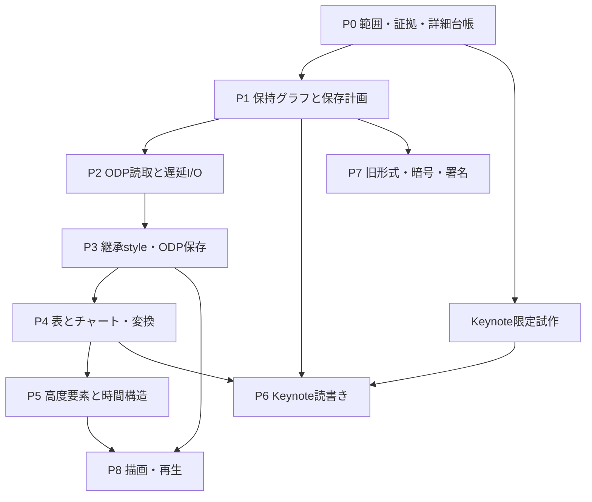

# SwiftSlides実装計画

2026-10-08の読取追加の現況は末尾「読取残件の完了範囲」と実装仕様を参照。以下のフェーズ本文と過去の実装記録は計画・履歴であり、過去の「未実装」を現況へ転用しない。

将来計画。設計範囲は[形式調査](format-research.md)、[機能台帳](feature-catalog.md)、[API設計](api-design.md)。現行の対応表示を将来計画だけで増やさない。

## 推奨する順序

まず原本保持・依存グラフ・保存前診断を強化する。次にODPと継承styleを入れ、表・チャート・メディア・時間構造を拡張する。Keynoteは早い段階で範囲を絞った調査を行い、コーデック公開は検証時点の最新版での確認後にする。旧形式・暗号・描画・再生は独立した長期工程とする。

安全な編集が先にあると、まだ意味を解釈できない機能を壊さず追加できる。全機能の解釈が揃うまで実用品を作れない設計を避ける。

工程番号は依存関係の目安。P6の試作、P7のCFB調査、P8の文字計測評価は前倒しできる。共通機能の実装と各形式の対応を同時完成と見なさない。

## 現状と今回の実現性確認

参照時点のSwiftSlidesは`193495f`、SwiftSheetsは`d153773`。現行実装を読み、値型モデル、CodecSet、OPC/ZIP/XML、部分編集writer、危険編集の拒否、テストと検証記録を確認した。以下はコード調査からの判断で、新規コーデックの成功実験ではない。

| 候補 | 実現性の根拠 | 未解決事項 |
|---|---|---|
| 保存計画と原本inventory | PPTX writerが元データ・ノードを保持し差分を扱う | 依存を扱う共通graph、計画fingerprint、未知参照への制限 |
| ODP読取・保存 | 公開ODF仕様、既存ZIP/XML、SwiftSheetsのODS実装 | スライドのstyle継承、単一XMLのincremental parse/patch |
| Keynote低層 | SwiftSheetsにSnappy/IWA/Protobuf/遅延index実装がある | Keynote registryと参照graph、世代差、writer必須objects |
| 表・チャート | 既存Table、SwiftSheetsのデータモデル・Workbook I/O | merge、style region、cache/embedded Workbookの同期 |
| 高速な値型編集 | COWと_modifyがSwiftSheetsのCollectionで使われる | SwiftSlidesの直接配列編集、identity保持と計測 |
| 描画・再生 | 解決済みモデルから別rendererへ渡せる構成 | font metrics、固有effect、実アプリとの差。高難度 |

追加依頼により実装へ着手する。最初の変更範囲はSwift 6.4 / Swift 6言語モード、`@concurrent`の非同期I/O、協調キャンセル、TaskGroupの上限付き一括読取、形式能力概要と保持概要。今回B〜Dとして詳細参照inventory・保存計画・明示的な複製/取り込みの初期版を追加。E〜HでODP読取専用codec、限定書式索引、Keynote wire試作、選択reader/file targetの検証を追加。ODP保存とKeynote公開codecは後続工程とする。機能台帳のbaselineは調査時点`193495f`を維持し、新APIの現状は現行仕様とsupport.jsonで示す。

[性能記録](performance.md)は先行PPTX測定と、E〜Hの10/100/1000枚の選択reader・ODP・Data sink測定を分離して記録する。Keynote・大量メディアの速度とメモリの根拠に転用しない。既存[検証記録](verification.md)はPowerPointの開封確認とLibreOfficeの再保存を記録するが、今回新たに全機能を実アプリ検証したわけではない。

## 2026-10-08の読み取り拡張

gradient/pattern/image fill、crop、個別セル罫線、遷移・timing木、メディア参照、従来コメント、ODP型付き値・式を追加。原本保持・読取専用の境界・PPTXセル展開予算も検査した。LibreOffice再保存出力とKeynoteの新規PPTX出力をXMLと独立照合し、PowerPointは開封だけ確認した。Keynoteへの既存fixture取り込みは拒否されており、互換性成功とは扱わない。操作別の結果は[検証記録](verification.md)に記す。

全機能の意味解釈には到達していない。次の大きな読取範囲は、ネイティブKeynoteの型と参照graph、ODPの高度図形・メディア・時間構造、OOXMLの新コメントの意味モデル、実効継承・追加chart・数式・3Dの情報取得。再生と描画の完成は読取能力と別に判定する。

## 工程と完成条件

### P0 — 対応範囲と検証基盤

成果物:

- feature ID、形式、プロファイル、read/create/edit/preserve/convert/render/playごとの詳細ledger。
- OOXML XSD/拡張、ODF RNG、MS-PPT records、Keynote型registryの版・由来・hash記録。
- スキーマから到達可能な型を列挙し、機能IDへ分類する生成器。未分類と未検証を表示する。
- producer/app/OS/version/profile別fixture manifest。架空の文書だけを使う。
- 実アプリで開く・修復要求・再保存・PDF化・再生を検査するoracleの操作仕様。

完成条件: 全項目の状態が明示され、未分類・未検証を成功扱いしない。現在のsupport ledgerを自動生成する新台帳へ移す場合は、回帰検査を弱めず移行する。

### P1 — 安全な編集の共通基盤

成果物:

- PackageGraph、論理IDと元IDの対応、既知・未知参照のinventory、PresentationDiff。
- 保存計画、diagnostic分類、source/model/options fingerprint、unsafe edit拒否。
- IDによる編集、transaction、明示duplicate/import、atomic file target。
- 現行API互換性のconsumer検査。公開varによる直接変更も計画へ反映。

完成条件: 1要素編集で無関係のXML/拡張/アセットを保持する。削除や複製で既知参照を整合させ、未知参照を安全に判断できなければ拒否する。失敗・キャンセル・容量不足で出力先を壊さない。未変更保存は全byte一致。

最初はPPTXだけで実装し、共通層の契約を固める。新規生成・読取・部分編集の3経路を同じテスト結果に混ぜない。

### P2 — ODP読取と遅延I/O

成果物:

- SlideODPのpackage/manifest/version detection、styles index、pages reader。
- 図形・group・text・image・table・notesの直接値読取と原本保持。
- URLを扱えるコーデック能力、SlideReader、選択read、bounded async sequence。
- 入力展開予算、巨大反復表とIWA用予算の共通設計、working set測定。

完成条件: ODPを空のPresentationに変えず、未知style/objectを診断する。省略・未ロードのスライドを原本として扱う。巨大なcontent.xmlでindex cost、1枚のread cost、peak RSSを分けて測る。未解決の外観を直接値と区別する。

ODPの書戻しをまだ提供しない場合はread-only capabilityを明示する。登録されたcodecがwriteも成功すると仮定しない。

### P3 — 継承、図形書式、基本保存

成果物:

- PPTX/ODPのmaster/layout/placeholder/theme/style解決と出典。
- gradient/pattern/image fill、geometry、textの高度直接書式、background。
- ODP新規生成・部分編集、FODP、テンプレート・ショー・Strict生成。
- StreamingWriterとFileTargetによる大容量新規資料生成。

完成条件: styleの省略・継承・noneを保つ。新規・編集保存をスキーマ検証し、実アプリで修復要求なく開き再保存できる。キャッシュの陳腐化を処理し、template/importのIDと資源が重複しない。renderer不在でも意味と原本保持は検証できる。

### P4 — 表・チャート・実務変換

成果物:

- merge/per-edge border/table styles、typed cell/formula cache。
- 基本チャート、axes/series/labels/styleとdata source、埋込Workbook。
- SwiftSheets bridgeの限定prototypeとpartial linking。
- PPTX↔ODPのSavePlan/ConversionResult、明示fallback、損失policy。

完成条件: 表・チャートは対象形式で再編集可能。データと表示cacheに食違いがあれば診断する。式を持てない表へ黙って式を捨てない。PPTX→ODPとODP→PPTXを別のfixture集合で判定し、各段階の損失を返す。

最初の実用品の候補: 既存PPTXテンプレートから表・画像・テキストを差し替え、ODPも読み取って安全にPPTXへ出す。未対応機能を含む資料では保存計画が差を示す。

### P5 — 高度要素と時間構造

成果物:

- media、equation、diagram、ink、3D、comments/accessibilityの段階的モデル。
- transition/timeline/trigger graph、paragraph/chart/diagram builds。
- 共通化できないeffectのNativeFeatureDescriptorと原本保持。

完成条件: パラメータと対象参照の意味を保ち、タイムラインから参照される要素の編集を検査する。記述の読書き対応と再生対応を別表示する。SmartArt再配置、3D表示、固有effectの見た目が未検証ならその範囲を残す。

### P6 — Keynote

前提: P0の限定試作で最新版の型・文書世代・資源の範囲を確定する。Numbersのtype registryを流用しない。実アプリ確認は検証時点の最新版だけでよく、旧版の確認を完成条件にしない。

成果物:

- 確認した最新版に対応する型registry、IWA store、object/data references、未知fieldの保持。
- SlideKeynoteのinspect→read→原本編集→新規生成の段階公開。
- 基本図形・文字・画像・表・チャート・notes・buildsの対応。
- PPTX/ODP/Keynoteの6方向変換と固有機能の診断。

完成条件: 検証時点の最新版Keynoteで再保存後も正しく開く。アプリ版・OS・registryの由来を記録する。未知typeを含むfixtureで、未変更保存と安全な局所編集が保全される。旧版アプリの確認は不要だが、未検証の文書世代を対応済みと推測せず、検査結果と拒否方針に出す。新規生成は必要オブジェクト群が確定するまで提供しない。

### P7 — 旧形式・暗号・署名

成果物: SlidePPTLegacy、旧Keynote/Impress、Decrypt/Encrypt、signature verification/removal/re-sign、macro/script metadata policy。

完成条件: 文書種と保護種別を正しく区別し、wrong password・破損・未対応方式を明示。既存マクロは実行せず保持。署名付き文書の未変更保存と編集時の失効を区別。暗号書込みと復号を別製品として部分リンク検査する。

IRM等の外部サービス依存は、認証情報やサーバーが必要な能力として分離する。単なる「パスワード対応」と表示しない。

### P8 — 外観と再生の再現

成果物: display list、font resolution/text metrics、PDF/画像、layout validation、timeline evaluator、video/GIF/HTML出力。

完成条件: 同じフォント・OS・実アプリ版の比較条件を固定。位置・改行・glyph・色・効果の差を記録し許容差を宣言する。動作はevent sequenceと時間、media、interactive actionで確認する。アプリ固有のレンダラーを完全に再現できたと未測定で表示しない。

## 最初に行う試作

| 試作 | 最小の入力・操作 | 続行条件 | 失敗した場合 |
|---|---|---|---|
| 保存グラフ | chart/animation/opaqueを含む架空PPTXで本文編集とshape削除 | 安全な部分編集成功、未知依存の削除拒否 | graph境界を狭め、原本編集範囲を限定 |
| ODP | 2枚、master/style、group、image、notes。読取→未変更→text1箇所編集 | 未変更byte一致、編集後LibreOffice再読と外観比較 | style resolver/単一XML patchを先に修正 |
| Keynote低層 | アプリで作る2枚の架空資料。index抽出→再包装 | 原本と未知field保全、同版アプリで開ける | 書込み公開を止めread/inspectを先行 |
| Keynote局所編集 | title1箇所、位置1箇所、image1箇所の独立変更 | length/reference/digest整合、app再保存成功 | template patch中心に範囲を限定 |
| COW/遅延I/O | 100/1,000枚、共有画像、large XML、style多数 | 時間/RSSとcopy回数が操作規模に沿う | Collection/index/cache設計を修正 |

試作は架空fixtureで行い、検証済みの最小コードを本実装へ移す。試作の成功を全機能対応に拡大解釈しない。Keynote型定義を参照する前に由来と再利用条件を確認する。

## 検証マトリクス

各feature/profileに次のケースを持つ。通常の編集で安全性を変えるコードには、その変更なしでは失敗する回帰検査を追加する。

| 操作 | 正例 | 負例・不明状態 |
|---|---|---|
| read | producer作成物の値と構造を独立期待値で比較 | 壊れたXML/IWA、missing refs、unknown type、限度超過 |
| create | 新規文書→schema/独立parser/実アプリ | 不正model、非有限数、未対応profile |
| edit | 本文/位置/style/削除/複製の単独・複合変更 | 依存破損、未知参照、signature、重複ID |
| preserve | 全byte一致、未編集part/field一致 | 見えない拡張・分岐・外部資源・原本外部変更 |
| convert | 6方向、元producer×dest profile、モデル比較 | 固有機能、macro、未知object、fallback編集可能性 |
| render/play | 同条件のPDF/画像、時間とevent記録 | 欠損font、未対応effect、再生codec・機器不足 |
| streaming | cancel/disk full、close成功、bounded demand | 未解決ID、一時file回収失敗、入力の途中変更 |

fixture manifestの項目: feature ID、origin app/version/OS、format/profile、operation、expected semantic properties、unknown inventory、comparison domain、time/RSS measurement context、result（pass/fail/unverified/notApplicable）、未判定理由、tool versions。renderではpixel差だけで意味を判定しない。再保存時の不要metadata更新やcompression差は許容するが、意味の差をそれに紛れさせない。

アプリ版の対象: PowerPoint Windows/Mac、LibreOffice、Keynote macOS/iOSの必要環境をP0で決める。Keynoteは各確認環境で検証時点の最新版だけを対象とし、過去のアプリ版を揃える必要はない。実アプリがない、ライセンスが閲覧専用、OSが違う等はunverifiedとする。自動テストのskipをpassとして互換率に含めない。

## 性能測定

| 資料 | 主な確認 |
|---|---|
| 10/100/1,000枚のtext/shape中心 | inspect/read/noop/1要素edit/createの時間とpeak RSS |
| 同じ画像を共有 / 各枚に別画像 | asset遅延load、重複排除、file直接出力 |
| 多数のmaster/styleと複雑な文字 | style解決cache、文字計測、COW編集のコスト |
| table/chart/embedded Workbook多数 | data/cache同期、dependency graph、cell予算 |
| 動画・巨大画像・unknown parts | 原本保持のmemory、copy/patchの展開量 |
| ODP単一XML / Keynote多数IWA | 索引構築と必要1枚read、cache evictionの差 |

各操作のrelease build、入力サイズ/展開量、Swift/OS/CPU、試行数、中央値と上位値、peak RSS、cold/warm条件を併記する。計画・読み込み・エンコード・出力時間を区別する。性能比較は旧新を同条件で交互実行する。メモリ削減だけで「高速」と表示しない。

目標は、未変更保存で不要な再圧縮をせず、1要素編集で全assetをmodel化せず、streamingで全スライドを保持しないこと。現行PPTX writerは未変更パーツの圧縮済payloadを転写し、必要なパーツだけ展開する。これは全CRC検証とは異なる。完全保持、全検証、最小memoryのトレードオフは結果に記録する。

## 着手可能な次のバックログ

Swift 6.4の基盤に加え、Aの初期拡張を実装済み: FeatureID・プロファイル・操作別の32能力宣言、fixtureと回帰テストに結び付く23証拠、位置と処理内容を持つ構造化診断。未掲載機能・操作・プロファイルはunverifiedとし、217機能の全対応を主張しない。正典は`docs/capabilities.json`、生成と検査は`scripts/build-capabilities.py`。B〜Dの初期版も実装・回帰検査済み。E〜Hの限定範囲も実装・検証済み。現行の詳細台帳は42宣言・26証拠。全P1/P2/P3/P6完了を意味しない。

| 順 | タスク | 完了を判断するもの |
|---|---|---|
| A（初期拡張済み） | 詳細feature別capabilityと診断 | 形式・プロファイル・操作を分離し、fixture hash・テスト・限定範囲を紐付け、未掲載をunverifiedとして返す |
| B（初期版済み） | PPTX参照inventoryの構築 | timing/connector/link/unknown referencesを位置つきで列挙。非XML内部は未解釈 |
| C（初期版済み） | SavePlanとstale plan検査 | model/原本snapshot/optionsのSHA-256で誤保存を拒否。事前エンコード方式、元URLの監視は未実装 |
| D（初期版済み） | 明示duplicate/import | notes/chart/workbook/assets/linksを含むcloneでID整合。未知参照・異profile・notes master競合は拒否 |
| E（限定試作済み） | ODP fixture・style resolver試作 | 直接指定・master・automatic/named styleの期待値一致、ODF 1.3 RNG適合 |
| F（読取専用実装済み） | ODP read-only codec | 基本要素・保持診断・破損拒否、ODF 1.3/LibreOffice 1.4 fixture、独立consumer |
| G（限定試作済み） | Keynote型とコンテナの限定試作 | 最新版15.4で再包装・同長title1field変更・再保存・再開封。codec未提供 |
| H（初期版検証済み） | reader/file-targetの性能検証 | 10/100/1000枚の時間/RSS、cancel・実ENOSPCで元保存先保持 |

B〜Dは独立consumer・部分リンク・python-pptxによるパーツ/意味検査と、LibreOfficeで3文書の再保存を確認。PowerPointでの新規確認、全未知依存、file-backed遅延I/O・cache予算、全診断収集は未完了。String IDの編集とwriter検査付きtransactionは現行仕様へ移し、外部consumerと失敗時の取り消しを検査する。型付きID/CollectionとTextRangeは将来案。選択readerとData用file targetは追加し、容量不足は検証済み。元URLの変更を読むfile readerがないため、Cは保持Data snapshotを境界とする。

残る工程を小さい変更単位で進め、各変更で現行仕様→実装→回帰検査→対応表示の順に更新する。

## 見積りと公開条件

台帳の各項目は作業量の単位ではなく分類であり、1行が1日で終わるとは見積もらない。特にstyle、chart、Keynote、legacy、描画・再生は多数の子機能を含む。全範囲を短期間で実装できるという見積りはしない。

最初の調査・試作は各テーマを2〜5作業日の上限で区切り、成功条件と未解決範囲を報告してから次の範囲を見積もる。この上限は完成予測ではない。実装マイルストーンは、安全なPPTX編集、ODP基本読書き、表・チャート変換、検証世代限定Keynote、描画・再生の順に設け、日付は試作後に決める。

公開前に`swift test`、`swift build -c release`、`python3 scripts/check-contract.py`、`python3 scripts/check-public-content.py --history`、機能台帳と詳細能力台帳の`--check`を実行する。コーデック変更には該当schema/独立parser/実アプリoracle、公開API変更にはExamples/DocC/部分リンク、性能表示変更には同条件の測定が追加で必要。未検証・対象外を含めて対応表を更新する。

初期調査・設計・計画の段階ではcommit/push/tag/releaseを実施せず、レビュー可能な変更として残した。2026-10-08の追加依頼で、既存変更のcommit/pushと残読取APIの実装へ進んだ。

## 2026-10-08の残読取APIと復号

SlideKeynoteを読取専用で公開し、文書順・非表示・直接位置/回転・文字・画像・group・notesの確認済みsubsetと、全IWA object/field/data参照の不変索引を追加した。PPTXの新コメントthreadとscatter/bubble/多段カテゴリ、placeholder/themeの限定実効継承、ODPのtiming/media/annotationと原本XML構造、SlideDecryptのOOXML Agile/Standard・ODF AES・Keynote iwpv2復号を追加した。通常codecへ復号能力を混ぜず、詳細能力のproviderをSlideDecryptとして分離する。

この変更も全機能の意味解釈完了ではない。残る主な意味モデルはKeynoteの高度書式・表の式/結合・chart軸・固有buildと型の版差、ODPの高度geometry/chart/数式/3D、OOXMLの未解釈文字効果・数式/3D・外部workbook等。これらは原本XMLまたはIWA wire索引で取得し診断する。描画・再生、再暗号化、IRM/証明書、RC4/Blowfishは提供しない。公開capabilityを原本構造取得だけでsupportedへ引き上げない。

追加の確認済みsubset: KeynoteのUTF16文字run・段落/文字/shape style参照・BNC v5表セル・疎なchart grid・transition/build/chunkを投影。現行15.4の新規架空文書から表の文字/数値とchart値を公開consumerで独立照合した。

通常図形/接続線の数値Bezierパス、PPTXの効果/custom geometryの継承、ODP埋込chartのlocal-table/A1 rangeも追加した。既存変更は`ad33088`としてmainへpush済み。以降の追加実装は検査済みの作業ツリーとして残し、tag/releaseは作成しない。

## 2026-10-08のOMML数式とDrawingML 3D直接値

残読取項目から、PPTXのTextRun.equation（OMML型・引数境界・段落内順序）とElement.scene3D/shape3D（直接camera/light、深さ・押出し・bevel・色）を追加。合成Transitional/名前空間置換Strict fixtureで省略値・未知ノード・Choice選択・原本保持・危険な再構成の拒否を検査する。計算・LaTeX変換・描画・実効3D継承・3D model資源・MathMLは後続。実アプリの数式/3D互換性は未検証。ODP/Keynote書込、file-backed/StreamingWriter、旧形式、再暗号化、全機能の意味解釈・描画/再生も残る。

## 2026-10-08のODP数式と高度図形

保存・変換を対象外とした追加依頼で、ODPのMathML（埋込/段落内、token・分数・根号・添字・上下限・行列・annotation原本）とcustom-shapeのEnhancedGeometryを追加。16種類のODFパス命令、数値/modifier/guide参照、viewBox、text area、鏡像とhandle原本を投影する。未知命令は未解決として診断し、欠損参照・引数数・非有限値・展開予算を検査する。数式/geometryの原本は不変の共有storageで値型モデルとJSON契約を保ち、大きなElementのコピーによるstack超過を避ける。ODF 1.3合成fixtureと独立parser・公開consumerが検証範囲。

ODP 3D、guide/geometry式の評価、文字効果の追加解釈、Keynoteの式/結合/chart軸、外部workbook、file-backed reader、旧形式の読取は引き続き残る。ODP/Keynoteの保存、変換、描画/再生と実アプリ互換性は今回追加しない。

## 2026-10-08の残読取カテゴリ追加

上記の残読取カテゴリへ、追加文字外観/効果tree、ODF scene/object/extrusionとguide/handle式評価、PPTXの3D継承/model資源・workbook保存値、Keynoteの式token/結合/軸UFF・PreUFF、file-backed ZIP reader・LRU・変更検出、SlideLegacyの旧PPT/Keynote2 XML/SXI読取を追加した。Keynote 15.4生成の式=5とA1:B1結合、LibreOffice生成旧PPTの2枚の順序/本文を独立照合した。ODF 1.2/1.3/1.4の公式RNGに対して世代に合うhandle属性で確認する。

これは各カテゴリの確認済みsubsetで、全世代/全書式を解釈したという意味ではない。Keynoteの未知token/複合書式、旧形式の高度図形、独自engine、全式の再計算・描画/再生は原本/診断の境界を維持する。データ変換、新規保存、ODP/Keynote/旧形式の書込は今回追加しない。実アプリでの失敗ケースもverification.mdへ記録する。

## 読取残件の完了範囲（2026-10-08）

DrawingML評価、Workbook複合参照・共有式、Content MathML、ODP変形/text-path/3D幾何/Flat ODP/ページ別寸法、glTF/GLB資源、Keynote複合式・v5セル書式・軸複合値・parameterized/editable path・build詳細とschema拡張、XML/IWA位置索引・合計cache予算・文書内並列読取・directory file-backedを追加。参照inventoryはKeynote headerにも対応した。各APIの有限な契約と試験はimplementation-spec、support、verificationを正典とする。

保護方式、旧形式、Workbook旧XLS、Keynoteの旧cell storage追加は依頼により今回対象外。新規の保存・変換・再計算・描画/再生も追加しない。任意の未知文書世代、独自engineの実装、glTF extensionの全仕様を互換と保証することは完了条件に含めない。これらは原本・明示拡張器・未解決診断を返す。
